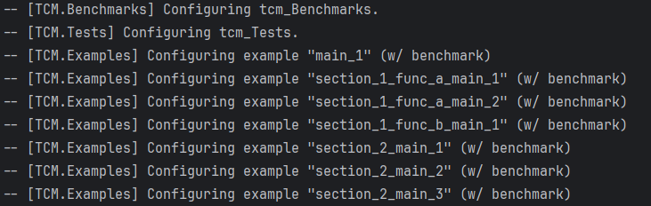
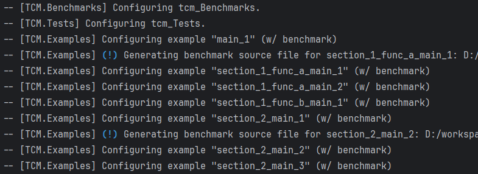
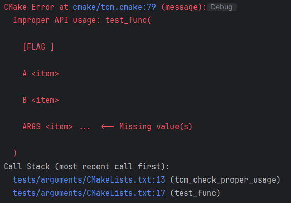

# TCM - A CMake Module


[](https://github.com/TBlauwe/tcm/releases)
[](https://github.com/TBlauwe/tcm/blob/master/LICENSE)
[](https://TBlauwe.github.io/tcm/)

)
)
)

__TCM__ is a opinionated CMake module to reduce boilerplate with common functionalities:

* Documentation with __[Doxygen](https://www.doxygen.nl/)__ and __[Doxygen Awesome](https://github.com/jothepro/doxygen-awesome-css)__ ([see exemple here](https://TBlauwe.github.io/tcm/)).
* Tooling:
  * __[ccache](https://ccache.dev/)__.
  * __[CPM](https://github.com/cpm-cmake/CPM.cmake)__.
* Testing with __[Catch2](https://github.com/catchorg/Catch2)__.
* Benchmarking with __[Google Benchmarks](https://github.com/google/benchmark)__.
* Configure targets with warnings, optimization, [emscripten](https://emscripten.org/), [ispc](https://ispc.github.io/) support.
* Examples with automated test and benchmarks.
* Miscellaneous cmake functions (logging, version from git, copying assets, etc.)

See [documentation](https://tblauwe.github.io/tcm/) for a closer look.

> [!NOTE]
>
> Defaults should give you good enough results.
> Most functions are customizable, but only to some extent.
> If you need full control, you are better off writing your own scripts.
 

## Pitch: "Composition over inheritance"

When starting a new project, it is common to start from a template or a generator to reduce boilerplate.
Overtime, they will update, fix bugs, bring new functionalists and so on.
Your preferences and requirements will also change.
These "inheritance" approaches make it hard to keep up with them after a project was started.
__For my projects, I thought that some functionalities should be better off as CMake modules for a more "compositional" approach.__
It is easier to update and mixmatch functionalities. 

> [!NOTE]
> 
> __To be clear, there is no "TCM over cmake-init" or any other templates, modules, etc.__
> You can perfectly start a project with __[cmake-init](https://github.com/friendlyanon/cmake-init)__ and use some functionalities provided by __TCM__.
> __TCM__ is an opinionated CMake module, use functionalities you like others without cluttering your code.
 
---

### A Personal note

_It was an interesting challenge, that started from the frustration of a [template](https://github.com/TBlauwe/cpp_lib_starter) I wrote._
_I wanted it to be more configurable and adaptable to differents preferences / requirements._
_Also, it was cumbersome to update projects built from it._
_I thought about writing a generator, but there is already __[cmake-init](https://github.com/friendlyanon/cmake-init).__
_And there is still the problem of changing a project after it was generated.__

_I thought it would be cool, if there was an easy-to-integrate library where I could pick functionalities as required._
_Cmake modules seemed like a great fit and so was born TCM._
_Overtime, I can work on new functionalities, fix bugs, etc. and easily share them with my projects, while still being able to use generators and templates._


## Show me the code

````cmake
set(TCM_TOOLS "CPM;CCACHE") # Defaults
# Option 1 - Update automatically
set(TCM_DOWNLOAD_VERSION "1.0.0")
include(cmake/get_tcm.cmake) # Download, cache and include tcm.cmake.
# Option 2 - Update manually
include(cmake/tcm.cmake) 

# API overview
tcm_documentation(FILES docs/pages ASSETS assets)
tcm_benchmarks(FILES bench.cpp)
tcm_tests(FILES tests.cpp)
tcm_examples(FILES examples WITH_BENCHMARK INTERFACE ExampleInterface)
tcm_target_enable_optimisation_flags(a_target)
tcm_target_enable_warning_flags(a_target)
tcm_target_copy_assets(a_target FILES assets/)
````

## Main Features

* __Easy to distribute / deploy__ 
  * Inspired by __[STB](https://github.com/nothings/stb)__, __TCM__ is packed into a single CMake script.
  * Public domain licence.
  * External files are embedded in `tcm.cmake`:
    * custom shell file for emscripten,
    * custom header, footer, css and layout for doxygen.
* __Keep your CMake wokflows__
  * TCM doesn't try to change how you write CMake files.
  * Functions are standalone, only use what you need.
  * Most CMake variables are set only if they were not already defined.
* __Modern CMake__
  * Try to be up to date with modern cmake practices, using resources like :
    * [Craig Scott resources](https://crascit.com/2019/10/16/cppcon-2019-deep-cmake-for-library-authors/)
    * [CLI Utils - Modern CMake](https://cliutils.gitlab.io/modern-cmake/README.html)
    * [cmake-init](https://github.com/friendlyanon/cmake-init)
    * [CPM](https://github.com/cpm-cmake/CPM.cmake)
    * [FIPS](https://github.com/floooh/fips)
    * and also many open-source projects.
  * Heavy operations are cached
    * On subsequent runs, changes from previous run are prefixed by `(!)` (blue-colored if possible).

| Before | After modifying some examples |
| --- | --- |
| | |

* __Integrated documentation__
  * When API is misused, error logs explain how to use it, e.g. with `test_func(A test B test ARGS)`
 
| Before                                      |
|---------------------------------------------|
|  |
 

## Installation

You can either:

* download or copy `get_tcm.cmake`, a script to easily download and update `tcm.cmake` through cmake.
 
```cmake
set(TCM_DOWNLOAD_VERSION 1.0.0)
include(cmake/get_tcm.cmake)
```

* or download `tcm.cmake` directly

```cmake
include(cmake/tcm.cmake)
```

These two files are also available at these URLS (using wget):

```
wget -O cmake/tcm.cmake https://github.com/TBlauwe/tcm/releases/download/1.0.0/tcm.cmake
wget -O cmake/get_tcm.cmake https://github.com/TBlauwe/tcm/releases/download/1.0.0/get_tcm.cmake
```


## Ideas / Backlog

- [ ] Check if some functionalities, properties and variables should be added / reworked as a target.
- [ ] Propose an optional checkup and warn for missing tools
- [ ] Install
- [ ] Packing
- [ ] Bindings
- [ ] Propose a single function to parametrize target according to current settings (optimization, warnings, emscripten)
- [ ] For readme, generate credits (from cpm dependencies ?)
- [ ] For readme, generate header (automatic badges from workflows ?, toc)
- [ ] Generate a dummy doxygen page to include, so they can be showcased in the documentation.


## Credits

This project was inspired by __[STB](https://github.com/nothings/stb)__, __[FIPS](https://github.com/floooh/fips)__ and __[CPM](https://github.com/cpm-cmake/CPM.cmake)__.
