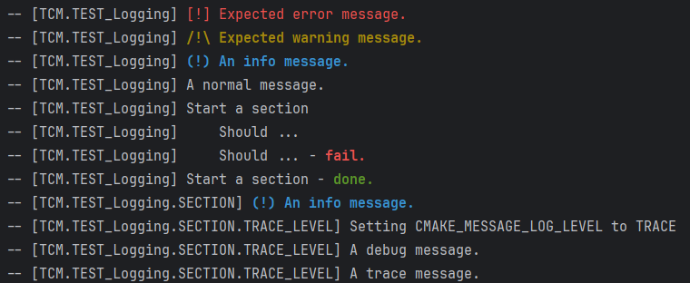

# TCM


A pluggable opinionated CMake script to provide some functionalities shared across C++ projects.
Only use what suits you !

* Setup __[CPM](https://github.com/cpm-cmake/CPM.cmake)__ for dependency management.
* Setup project's version from git in dev mode or from generated `VERSION` file in consumed mode.
* Setup cache using tools like __[ccache](https://ccache.dev/)__.
* Setup documentation with __[Doxygen](https://www.doxygen.nl/)__ (if installed) and __[Doxygen Awesome](https://github.com/jothepro/doxygen-awesome-css)__.

And some other handy functions :
* Logging facilities for your cmake files
* and some other functions.

See [Overview](#overview) below for a closer look.

> [!NOTE]
>
> As most of my other repositories, they are mostly intended for personal usage and learning.
> You are probably better off looking elsewhere, like [awesome cmake](https://github.com/onqtam/awesome-cmake).

__Rationale__ 

C / C++ projects have a lot of boilerplate (for building, packaging, testing, benchmarking, profiling, documentation, etc.)
One solution is to start from a template. Overtime, template will update, fix bugs, bring new functionalities and so on. 
There are ways to sync changes, but there are still some friction, notably with template with generated code.
In some way, we could see this as the inheritance vs composition problem.
This CMake module favors composition over inheritance. 
Choose functionalities you need, without the burden of those you don't need.


## Overview

### CPM

Download and setup .

```cmake 
#set(CPM_SOURCE_CACHE "~/.cpm/")  # You can also set it as an environment variable, so it works across projects.
#set(CPM_DOWNLOAD_VERSION 0.40.2) # Default Value
#set(CPM_HASH_SUM "c8cdc32c03816538ce22781ed72964dc864b2a34a310d3b7104812a5ca2d835d") #Default value
tcm_setup_cpm()
```

___

### Cache

Setup __[ccache](https://ccache.dev/)__, if installed.

```cmake 
tcm_setup_cache()
```

___

### Version setup from Git

Set version from __Git__ if used in top-level project or from generated `VERSION` file.

```cmake 
tcm_setup_project_version()
```

> [!NOTE]
> 
> Support a subset of semantic versioning : major.minor.patch

___


### Automated Doxygen Setup

Setup documentation with [Doxygen](https://www.doxygen.nl/) (if installed) and [Doxygen Awesome](https://github.com/jothepro/doxygen-awesome-css)

```cmake 
tcm_setup_docs()
```
Here what it gives with this repository.



Two targets are provided : 

* `docs` - to build documentation
* `open_docs` - to open documentation

Default values should give you suitable results. You may override some doxygen config options by setting them before the call, e.g.:

```cmake
set(DOXYGEN_HTML_EXTRA_STYLESHEET "...")
tcm_setup_docs()
```

> [!NOTE]
> 
> It uses `doxygen_add_docs` under the hood. See `SETUP-DOCUMENTATION` in tcm.cmake (prefer the one in src/ if you have access to the repository).

___

### Logging

Usual logging functionalities.

```cmake 
set(TCM_VERBOSE ON)                   # Toggleable verbosity

# Usual logging functions
#tcm_error("Abort message." FATAL)    # A FATAL_ERROR message under the hood. 
tcm_error("Expected error message.")  # A STATUS message under the hood.
tcm_warn("Expected warning message.") # A STATUS message under the hood.
tcm_info("An info information.")      # A STATUS message under the hood.
tcm_log("A normal message.")          # A STATUS message under the hood.

set(CMAKE_MESSAGE_LOG_LEVEL TRACE)    # To enable lower-level message.
tcm_debug("A debug message.")
tcm_trace("A trace message.")

# Nestable sections
tcm_begin_section("SECTION")
    tcm_log("A normal message in a section.")
    tcm_begin_section("SUBSECTION")
        tcm_log("A normal message in a subsection.")
    tcm_end_section()
tcm_end_section()

# OUTPUT:
# -- [PROJECT_NAME] [!] Expected error message.
# -- [PROJECT_NAME] /!\ Expected warning message.
# -- [PROJECT_NAME] (!) An info message.
# -- [PROJECT_NAME]     A normal message.
# -- [PROJECT_NAME]     A debug message.
# -- [PROJECT_NAME]     A trace message.
# -- [PROJECT_NAME | SECTION]     A normal message in a section.
# -- [PROJECT_NAME | SECTION | SUBSECTION]     A normal message in a subsection.
```
Some additional functions:
* `tcm_check_start(), tcm_check_pass(), tcm_check_fail()` for check section.
* `tcm_indent(), tcm_outdent()` for indenting/outdenting messages.

___

### Miscellenaous functions

```cmake
tcm_suppress_warnings(_target)
```
Should suppress warnings emitted from `_target`, by adding `SYSTEM` modifier to its include directories.

> [!WARNING]
>
> Doesn't seem to always works.
   
```cmake
tcm_option_define(_target _option)
```
Define `-D${_option}` for `_target` when `_option` is ON.

```cmake
tcm_target_assets(_target _src_dir _dst_dir)
```
Copy folder `_src_dir` to `_dst_dir` before target is built.
 
___

### Variables

Following variables are available after including `tcm.cmake` or calling `tcm_setup()`.

| Name                       | Description                                                                                                                                        |
|----------------------------|----------------------------------------------------------------------------------------------------------------------------------------------------|
| TCM_SUPPORT_COMPUTED_GOTOS | Some compiler, like MSVC, don't support them (useful for direct threaded VM.)                                                                      |
| TCM_WARNING_GUARD          | Expand to `SYSTEM` when project is consumed to prevent warnings.<br/>Usage: `target_include_directories(_target ${TCM_WARNING_GUARD} PUBLIC dir/)` |
 

## Installation

> [!WARNING]
>
> Under construction / Needs testing.
> 
Same instructions as for any single file script (See [CPM's documentation](https://github.com/cpm-cmake/CPM.cmake?tab=readme-ov-file#adding-cpm)).

### From console:

* Create a directory to hold the script.
```bash
mkdir -p cmake
```
* Download either :
  * `get_tcm.cmake` - for a more efficient way to download new version.
  ```bash
  wget -O cmake/tcm.cmake https://github.com/TBlauwe/tcm/releases/download/0.2/tcm.cmake
  ```
  * Include it in your CMakeLists.txt, e.g. 
  ```cmake
  set(TCM_DOWNLOAD_VERSION 0.3)
  include(cmake/get_tcm.cmake)
  ```
  
  *--or--*

  * `tcm.cmake` - to get file directly
  ```bash
  wget -O cmake/tcm.cmake https://github.com/TBlauwe/tcm/releases/download/0.2/tcm.cmake
  ```

  * Include it, e.g. `include(cmake/tcm.cmake)`

### From CMake:


```cmake
file(
    DOWNLOAD 
        https://raw.githubusercontent.com/TBlauwe/tcm/refs/heads/master/cmake/tcm.cmake
        ${CMAKE_CURRENT_BINARY_DIR}/cmake/tcm.cmake
)
include(${CMAKE_CURRENT_BINARY_DIR}/cmake/tcm.cmake)
```

### Manual:

* Download and copy `tcm.cmake` in your project, e.g. `root/cmake/tcm.cmake`.
* Include it, e.g. `include(cmake/tcm.cmake)`

## Credits

This project was inspired by __[FIPS](https://github.com/floooh/fips)__ and __[CPM](https://github.com/cpm-cmake/CPM.cmake)__.
